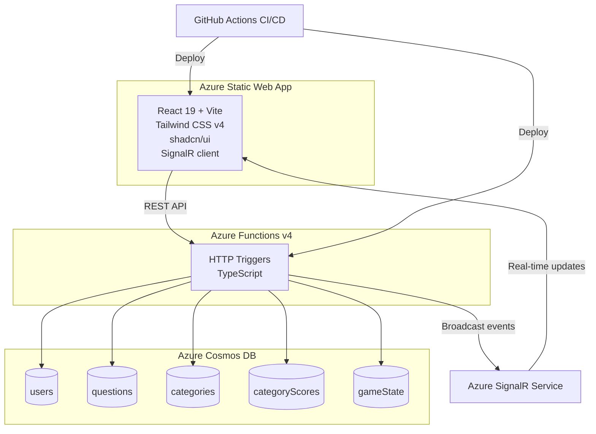

# ⚡ Fastest Finger Quiz

A competitive speed-trivia game where players race to answer Azure and GitHub Copilot questions. The fastest correct answer wins — points accumulate across sessions, and a real-time leaderboard fuels the rivalry.


## How It Works

1. **Open the game link** — a round of 1–3 Azure/Copilot questions loads
2. **Timer starts immediately** — answer as fast as you can
3. **Get instant feedback** — correct answer reveal, points awarded with speed bonus
4. **Leaderboard updates in real-time** — see where you rank via SignalR

## Architecture



## Tech Stack

| Layer | Technology |
|-------|-----------|
| **Frontend** | React 19, Vite 8, TypeScript, Tailwind CSS v4, shadcn/ui, Phosphor Icons |
| **Backend** | Azure Functions v4 (Node.js/TypeScript) |
| **Database** | Azure Cosmos DB (serverless) |
| **Real-time** | Azure SignalR Service (serverless) |
| **Hosting** | Azure Static Web Apps (Free tier) |
| **IaC** | Bicep (modular: SWA + Cosmos DB + SignalR) |
| **CI/CD** | GitHub Actions (OIDC auth, single workflow) |
| **Testing** | Vitest, Testing Library (143 API + 10 E2E tests) |

## Project Structure

```
├── .github/workflows/
│   └── deploy.yml              # CI/CD: infra → build → test → deploy
├── docs/
│   └── PRD.md                  # Product requirements document
├── infra/
│   ├── main.bicep              # Orchestrator (all Azure resources)
│   ├── main.bicepparam         # Environment parameters
│   └── modules/
│       ├── staticWebApp.bicep  # SWA resource
│       ├── cosmosDb.bicep      # Cosmos DB + containers
│       └── signalr.bicep       # SignalR Service
├── src/
│   ├── api/                    # Azure Functions backend
│   │   └── src/
│   │       ├── functions/      # API endpoints
│   │       ├── models/         # TypeScript interfaces
│   │       ├── services/       # Cosmos, scoring, leaderboard, SignalR
│   │       └── scripts/        # Seed questions script
│   └── frontend/               # React SPA
│       └── src/
│           ├── components/     # UI components (quiz, timer, leaderboard)
│           ├── contexts/       # UserContext, SignalRContext
│           ├── hooks/          # useTimer, useSignalR
│           ├── services/       # API client
│           └── test/           # Component + integration tests
└── staticwebapp.config.json    # SWA routing config
```

## Getting Started

### Prerequisites

- [Node.js](https://nodejs.org/) 20+
- [Azure Functions Core Tools](https://learn.microsoft.com/azure/azure-functions/functions-run-local) v4
- [Azure CLI](https://learn.microsoft.com/cli/azure/install-azure-cli)

### Local Development

```bash
# Clone the repo
git clone https://github.com/brenda-campbell/ghcp-intervals.git
cd ghcp-intervals

# Backend
cd src/api
npm install
npm run build
npm start                     # Runs on http://localhost:7071

# Frontend (new terminal)
cd src/frontend
npm install
npm run dev                   # Runs on http://localhost:5173
```

### Seed Questions

Populate the database with 28 Azure/Copilot quiz questions:

```bash
cd src/api
# Set your Cosmos DB connection string
export CosmosDBConnectionString="your-connection-string"
npm run seed
```

### Run Tests

```bash
# API tests (143 tests)
cd src/api && npm test

# Frontend tests
cd src/frontend && npm test

# E2E tests (10 tests)
cd src/frontend && npm run test:e2e
```

## Deployment

### Azure Resources (IaC)

Infrastructure is defined in Bicep and deployed via GitHub Actions:

```bash
# Manual deployment (if needed)
az deployment group create \
  --resource-group rg-fastestfinger-dev \
  --template-file infra/main.bicep \
  --parameters infra/main.bicepparam
```

### GitHub Actions CI/CD

The workflow (`.github/workflows/deploy.yml`) runs on push to `main`:

1. **Infra job** — Deploys Bicep templates (OIDC auth)
2. **Build & Test job** — Installs, builds, tests both frontend and backend
3. **Deploy job** — Publishes to Azure Static Web Apps

#### Required Secrets

| Secret | Description |
|--------|-------------|
| `AZURE_CLIENT_ID` | App registration client ID (OIDC) |
| `AZURE_TENANT_ID` | Azure AD tenant ID |
| `AZURE_SUBSCRIPTION_ID` | Target Azure subscription |
| `AZURE_RG` | Resource group name |
| `AZURE_STATIC_WEB_APPS_API_TOKEN` | SWA deployment token |

### OIDC Setup

1. Create an App Registration in Azure AD
2. Add a Federated Credential (subject: `repo:brenda-campbell/ghcp-intervals:ref:refs/heads/main`)
3. Grant Contributor role on the resource group
4. Store IDs as GitHub repository secrets

## API Endpoints

### User Management
- `POST /api/users/login-or-create` — Create or retrieve user by email
- `GET /api/users/:id` — Get user profile by ID
- `GET /api/users` — List all users (admin only)
- `PATCH /api/users/:id/status` — Update user status (admin only)
- `DELETE /api/users/:id` — Remove user (admin only)

### Quiz & Questions
- `GET /api/questions` — Get current round questions (returns pinned questions if quiz active)
- `POST /api/answer` — Submit answer, receive points and feedback
- `GET /api/categories` — List all quiz categories
- `POST /api/categories` — Create new category (admin only)
- `PATCH /api/categories/:id` — Update category (admin only)
- `DELETE /api/categories/:id` — Remove category (admin only)

### Leaderboard & Scoring
- `GET /api/leaderboard` — Get top 10 players with ranks
- `POST /api/scores/reset` — Reset scores (admin only, supports filters by user/category)

### Game State & Admin Controls
- `GET /api/game/state` — Get current game state (active question, player count, category)
- `POST /api/game/set-category` — Set active quiz category (admin only)
- `POST /api/game/start-quiz` — Start new quiz round, pin questions (admin only)
- `POST /api/game/stop-quiz` — End current round (admin only)
- `PATCH /api/game/question-count` — Set questions per round: 1-20 (admin only)

### Real-Time & Presence
- `POST /api/game/heartbeat` — Keep-alive ping for active players
- `GET /api/game/online-players` — Get count of connected players
- `POST /api/negotiate` — SignalR negotiation for WebSocket upgrade

## Game Features

- **🎯 Quiz Flow** — 1–3 questions per round, 2×2 answer grid, progress tracking
- **🔒 Synchronized Questions** — Same questions for all players, ensuring competitive fairness
- **⏸️ Admin-Controlled Quiz** — Waiting room + admin start/stop with real-time player sync
- **⏱️ Countdown Timer** — Per-question countdown (default 10s, admin-configurable 5-60s) with color-coded progress bar, auto-timeout marks unanswered as incorrect
- **📊 Live Leaderboard** — Top 10 with gold/silver/bronze badges, real-time SignalR updates
- **🏷️ Multi-Category** — 6+ quiz categories (Technical, Movies, Geography, etc.) with admin switching
- **🔄 Score Reset** — Admin can reset all/selected/per-category players
- **🌙 Dark/Light Theme** — Toggle with localStorage persistence
- **⚙️ Configurable Questions** — Admin sets 1-20 questions per round
- **📡 Real-Time Presence** — Online player count via SignalR broadcast, 45s heartbeat
- **🔒 Anti-Cheat** — Server-authoritative timing, correct answers never sent to client
- **👤 Email Identity** — Email-based login, localStorage persistence, admin panel for user management
- **✨ Animations** — Answer feedback, page transitions, score counter, confetti on perfect rounds
- **🎭 E2E Testing** — Playwright browser tests with screenshots
- **📱 Mobile Responsive** — Touch-optimized, safe areas, fluid typography

## Design System

| Token | Value |
|-------|-------|
| Azure Blue | `#4A90E2` |
| Deep Space Gray | `#2A2D3A` |
| GitHub Black | `#1B1D23` |
| Electric Lime | `#C5F542` |
| Headings | Space Grotesk |
| Code / Scores | JetBrains Mono |

## Scoring

- **Correct answer**: Up to **200 points** — uses relative scoring: `score = round(200 × (fastestCorrectMs ÷ playerResponseMs))`, capped 1-200
- **Fastest correct answer**: Always gets **200 points** (the maximum)
- **Slower correct answers**: Score reduces proportionally — e.g., if fastest was 1.5s and you took 3s, you get 100 pts
- **Incorrect/Timeout**: 0 points (unanswered questions when timer expires are marked incorrect)
- **Ties broken by**: Fastest cumulative response time
- **Games Played**: Incremented once per completed round (not per question)
- **Fastest Time**: Per-question response times shown in round summary, fastest correct answer highlighted

### API Endpoints

| Method | Route | Auth | Description |
|--------|-------|------|-------------|
| POST | `/api/users/login-or-create` | — | Login or register by email |
| GET | `/api/users/:id` | — | Get user profile |
| GET | `/api/users` | Admin | List all users |
| PATCH | `/api/users/:id/status` | Admin | Toggle user active/inactive |
| DELETE | `/api/users/:id` | Admin | Delete a user |
| GET | `/api/questions` | — | Get quiz questions (pinned when started) |
| POST | `/api/answer` | — | Submit answer, get score |
| POST | `/api/game/round-complete` | — | Mark round as completed (increments gamesPlayed) |
| GET | `/api/leaderboard` | — | Top 10 + optional category filter |
| GET | `/api/categories` | — | List categories |
| POST | `/api/categories` | Admin | Create category |
| PATCH | `/api/categories/:id` | Admin | Update category |
| DELETE | `/api/categories/:id` | Admin | Delete category + cascade questions |
| GET | `/api/game/state` | — | Get current game state |
| POST | `/api/game/set-category` | Admin | Set active category |
| POST | `/api/game/start-quiz` | Admin | Start quiz (pin questions) |
| POST | `/api/game/stop-quiz` | Admin | Stop quiz |
| PATCH | `/api/game/question-count` | Admin | Set questions per round (1-20) |
| PATCH | `/api/game/timer` | Admin | Set timer per question (5-60s) |
| POST | `/api/scores/reset` | Admin | Reset scores (all/selected/category) |
| POST | `/api/game/heartbeat` | — | Online presence heartbeat |
| GET | `/api/game/online-players` | — | Get online player count |
| POST | `/api/negotiate` | — | SignalR connection negotiation |

## License

MIT
